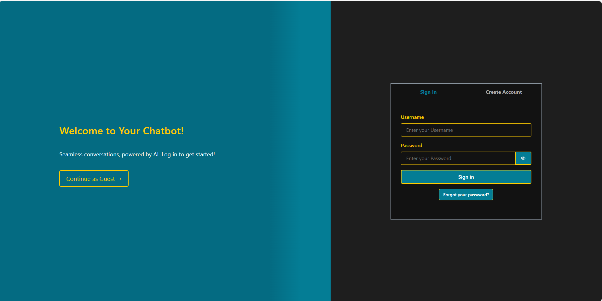
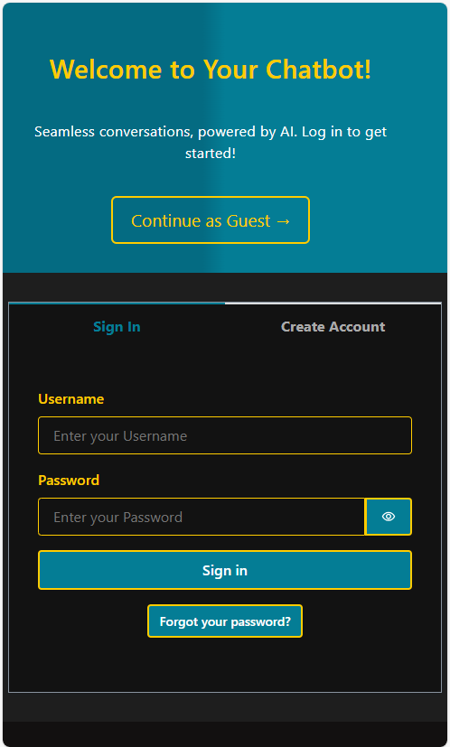
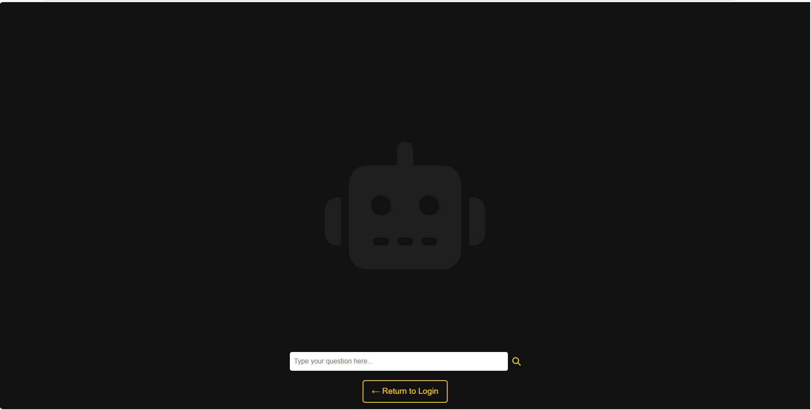
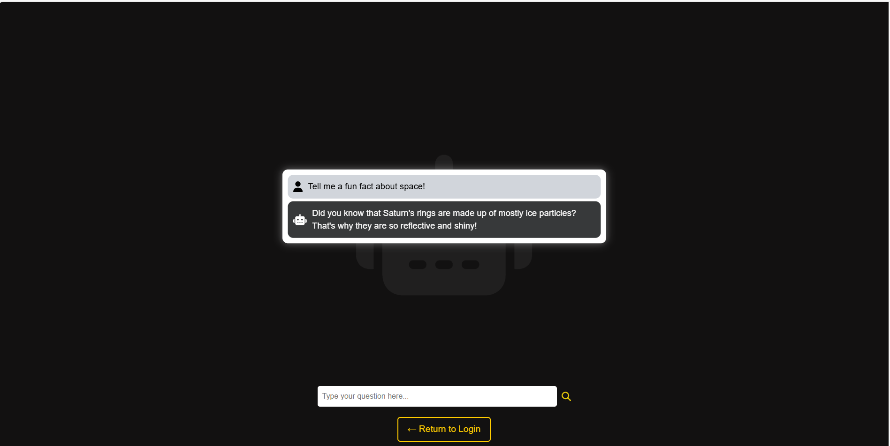
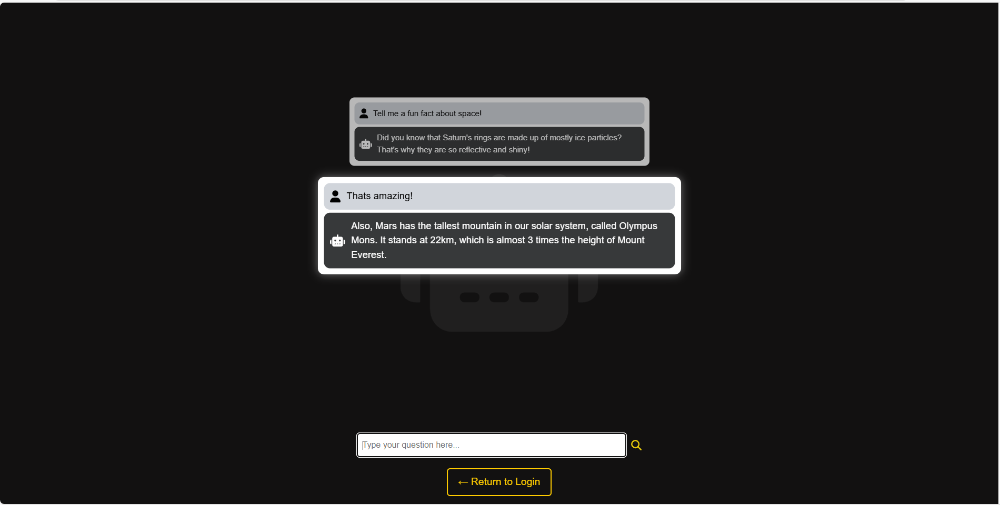
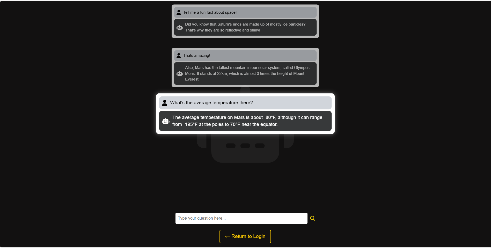

# 🤖 Chatbot-AI


## Overview
A sleek, responsive AI chatbot web application built with React, AWS Amplify for authentication, and OpenAI for real-time AI responses. Designed with a clean, Amazon-inspired UI and optimized for both desktop and mobile use.

---
## 🌐 Live Demo

👉 [View the deployed app](https://main.d3aa51l1wq81s7.amplifyapp.com)


---

## ✨ Features

🔐 **Secure Login with AWS Cognito**  
Users can sign up and log in through a secure Amplify-hosted login page. Sessions are handled automatically and passwords are stored safely using AWS services.

🎨 **Dark Theme Inspired by Amazon**  
The app uses Amplify’s default UI components with a custom dark theme and gold highlights to give it a sleek, clean look.

🤖 **Real-Time Chat Using OpenAI's API**  
The chatbot connects to OpenAI’s language model API to generate smart, real-time responses. Messages stream in as they’re received to keep things interactive.

📱 **Mobile-Friendly**  
The layout works great on phones, tablets, and desktops — it resizes automatically without breaking.

🧠 **Easy to Add New Features**  
The app is built in React with a simple layout, so it’s easy to update or expand later (like saving chat history or adding a database).

---

## 📸 Screenshots

### 🔐 Login Page (Desktop)


### 📱 Login Page (Mobile)


### 💬 Chat Examples

#### Search Prompt


#### Prompt Example 1


#### Prompt Example 2


#### Prompt Example 3


---

## 🛠 Tech Stack

- **React** – Frontend UI framework
- **AWS Amplify** – Handles authentication, hosting, and deployment
- **Amazon Cognito** – Manages user sign-up, login, and sessions
- **OpenAI API** – Powers real-time AI chat responses
- **Axios** – Used to send messages to the OpenAI API
- **React Router** – Handles in-app navigation
- **Amplify UI Components** – Prebuilt Amazon-style components for forms and layout
- **Font Awesome** – Icons used throughout the UI
- **CSS** – Custom styling and responsive layout

---

## 🚀 Getting Started Locally

```bash
git clone https://github.com/JakeDeines/Chatbot-AI.git
cd chatbot-ai
npm install
npm start
```


---

## 🧩 Future Improvements

- Save chat responses to a database
- Add user chat history view
- Integrate search results or external data
- Add a "favorite" or "like" system to save key replies
